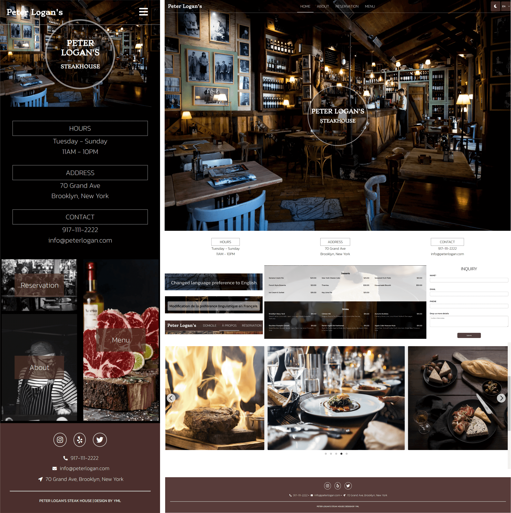

  <h1 align="center">Peter Logan's Steakhouse</h3>
  <h3 align="center">
    A responsive restaurant website built from scratch!
     
    <a href="https://peter-logans-steakhouse.netlify.app/"><strong>View Live Demo »</strong></a>
     
     
     
  </h3>

## About The Project

This is a steakhouse website made for CST8117 Cross-platform Web Design with the following features:

* Responsive layout for mobile, tablet, and desktop
* Dark mode available
* English and French language support
* Integrated HTML text menus

Team Member:

* [Yamiao Liu](https://www.linkedin.com/in/yamiaoliu/) - Leader, Mockup designer, CSS developer
* [Avinash Gardas](https://github.com/avinashgardas) - CSS developer
* [Sebstian Kamal](https://github.com/SebastianKamal) - JavaScript developer
* [Thanh Hao Huynh](https://github.com/thanhhao7up) - HTML developer

### Built With

* [HTML](https://html.spec.whatwg.org/)
* [CSS](https://developer.mozilla.org/en-US/docs/Web/CSS)
* [JavaScript](https://developer.mozilla.org/en-US/docs/Web/JavaScript)

## License

Distributed under the MIT License. See `LICENSE.txt` for more information.

## Acknowledgments

* [Netlify.com](https://netlify.com)
* [Flickity](https://flickity.metafizzy.co/)
* [Usplash.com](https://unsplash.com/)

(<a href="#top">back to top</a>)

